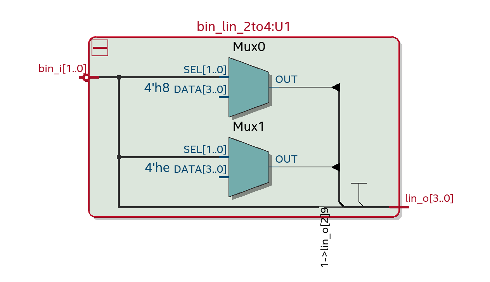
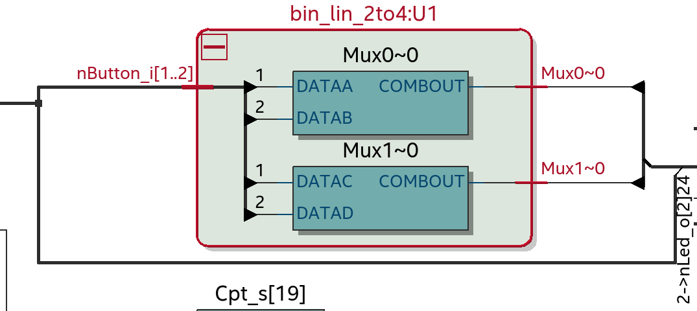
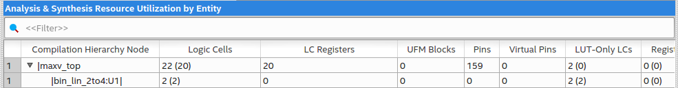
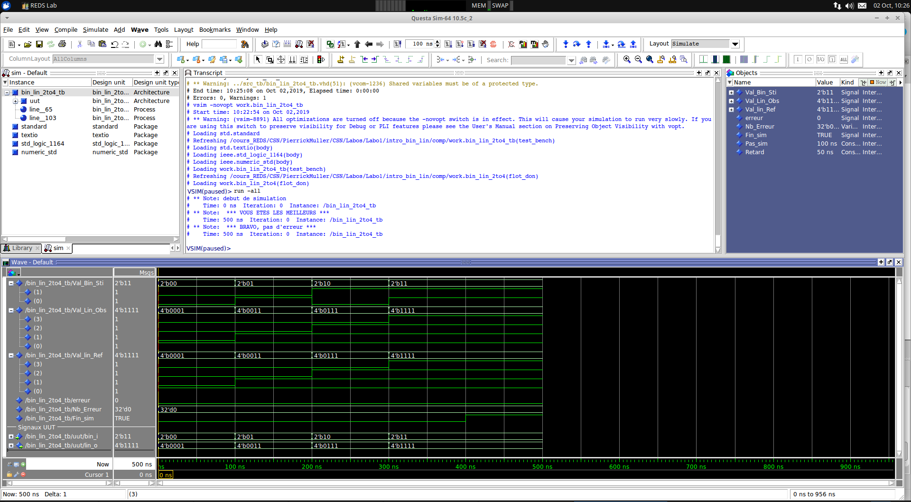

# CSN : Labo d'introduction Transcodeur Binaire / Linéaire

##### Auteur : Pierrick Muller
##### Date : 02.10.2019

## Description VHDL version TDV
```
-------------------------------------------------------------------------------
-- HEIG-VD, Haute Ecole d'Ingenierie et de Gestion du canton de Vaud
-- Institut REDS, Reconfigurable & Embedded Digital Systems
--
-- Fichier      : bin_lin_2to4.vhd
--
-- Description  : decodeur 2 bits en lineaire
--                Description avec une table de verite (TDV)
--
-- Auteur       : Etienne Messerli
-- Date         : 15.02.2015
-- Version      : 0.0
--
--
--| Modifications |------------------------------------------------------------
-- Vers   Qui   Date      Description
--
-- 0.1	Pierrick Muller	30.09.2019	Modification tdv
-------------------------------------------------------------------------------

library ieee;
use ieee.Std_Logic_1164.all;

entity bin_lin_2to4 is
      port( bin_i  : in std_logic_vector(1 downto 0);
                       -- valeur binaire en entree
            lin_o  : out std_logic_vector(3 downto 0)
                      -- valeur lineaire en sortie
           );
end bin_lin_2to4 ;

architecture tdv of bin_lin_2to4 is

begin

  with bin_i select
    lin_o <= "0001" when "00",
             "0011" when "01",
             "0111" when "10",
             "1111" when "11",
             "XXXX" when others; --simulation

end tdv;
```


## Vues RTL et Technology TDV


*Vue RTL*

On peut voir que la table de vérité à été réalisée à l'aide de deux multiplexeur 4 à 1, tout comme avec la technology view.


*Vue Technology*



*Quantité de logique bin_lin_2to4_tdv*

On peut voir que 2 cellules logiques sont utilisées pour le composant bin_lin_2to4

## Description VHDL version flot_don

```
-------------------------------------------------------------------------------
-- HEIG-VD, Haute Ecole d'Ingenierie et de Gestion du canton de Vaud
-- Institut REDS, Reconfigurable & Embedded Digital Systems
--
-- Fichier      : bin_lin_2to4_flotdon.vhd
--
-- Description  : decodeur 2 bits en lineaire
--                Description par flot de donnée avec
--                l'instruction when .. else
--
-- Auteur       : Etienne Messerli
-- Date         : 15.02.2015
-- Version      : 0.0
--
--
--| Modifications |------------------------------------------------------------
-- Vers   Qui   Date      Description
--
--0.1     Pierrick Muller  02.10.2019   Remplissage template
-------------------------------------------------------------------------------

library ieee;
use ieee.Std_Logic_1164.all;

entity bin_lin_2to4 is
  port( bin_i  : in std_logic_vector(1 downto 0);
                -- valeur binaire en entree
        lin_o  : out std_logic_vector(3 downto 0)
                -- valeur lineaire en sortie
       );
end bin_lin_2to4 ;

architecture flot_don of bin_lin_2to4 is

begin

  lin_o(0) <= '1' when bin_i >= "00" else
              '0';
  lin_o(1) <= '1' when bin_i >= "01" else
              '0';
  lin_o(2) <= '1' when bin_i >= "10" else
	      '0';
  lin_o(3) <= '1' when bin_i >= "11" else
	      '0';


end flot_don;
```

## Log de Questasim


On peut voir le résultat dans la console "Transcript"

## Description VHDL version 3 à 8

```vhdl
-------------------------------------------------------------------------------
-- HEIG-VD, Haute Ecole d'Ingenierie et de Gestion du canton de Vaud
-- Institut REDS, Reconfigurable & Embedded Digital Systems
--
-- Fichier      : bin_lin_3to8_flotdon.vhd
--
-- Description  : Transcodeur de binaire a lineaire 3 a 8
--                Chablon
--
-- Auteur       : Etienne Messerli
-- Date         : 13.02.2019
-- Version      : 0.0
--
--
--| Modifications |------------------------------------------------------------
-- Vers   Qui   Date       Description
--  
--0.1     Pierrick Muller  02.10.2019   Remplissage template
-------------------------------------------------------------------------------

library ieee;
use ieee.Std_Logic_1164.all;

entity bin_lin_3to8 is
  port( bin_i  : in std_logic_vector(2 downto 0);
                -- valeur binaire en entree
        lin_o  : out std_logic_vector(7 downto 0)
                -- valeur lineaire en sortie
       );
end bin_lin_3to8 ;

architecture flot_don  of bin_lin_3to8 is

begin

  lin_o(0) <= '1' when bin_i >= "000" else
	      '0';
  lin_o(1) <= '1' when bin_i >= "001" else
              '0';
  lin_o(2) <= '1' when bin_i >= "010" else
              '0';
  lin_o(3) <= '1' when bin_i >= "011" else
              '0';
  lin_o(4) <= '1' when bin_i >= "100" else
              '0';
  lin_o(5) <= '1' when bin_i >= "101" else
              '0';
  lin_o(6) <= '1' when bin_i >= "110" else
              '0';
  lin_o(7) <= '1' when bin_i >= "111" else
              '0';
end flot_don;

```
