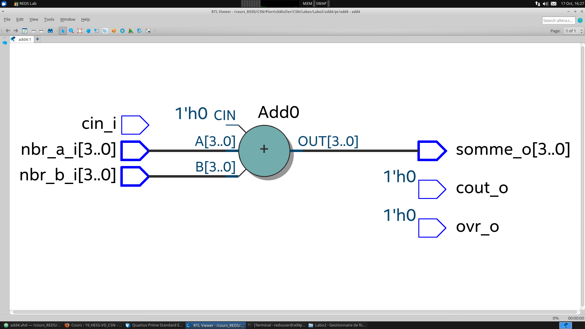
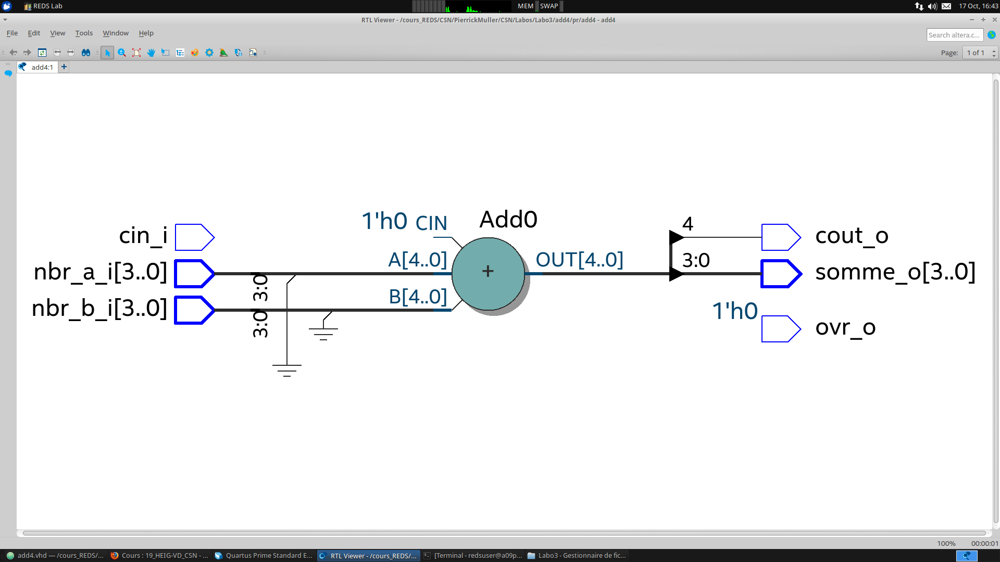
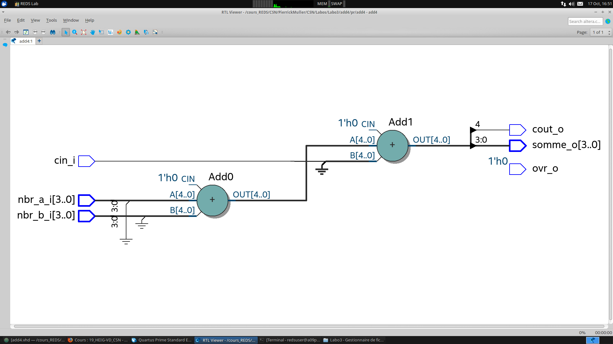
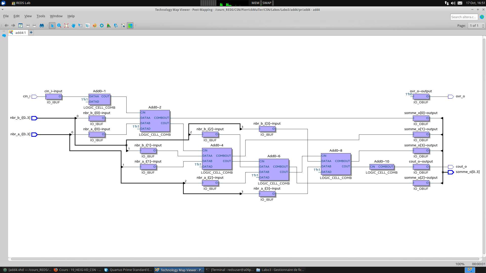
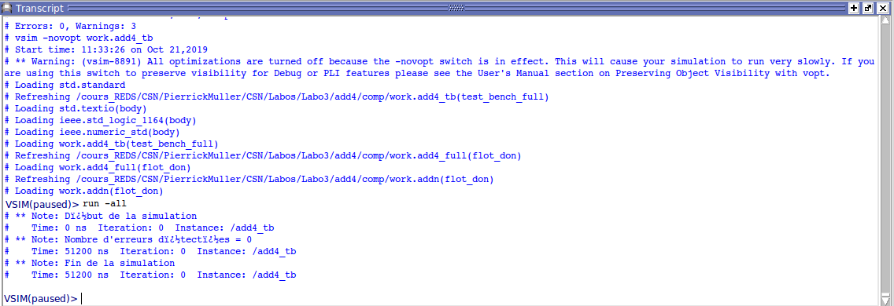

# Laboratoire 3
### Add4
#### Evolution de la vue RTL

Les images ci-dessus représentent l'évolution de notre description vhdl au travers des différentes étapes qui nous étaient demandées. La première image représente la description sans gestion du carry et du carry out. La deuxième image ajoute la gestion du carry out et la dernière la gestion du carry in. La dernière vue RTL est composée de 2 additionneurs car elle présente l'addition du carry in en plus.

#### Vue technologique finale

On peut voir dans la vue technologique de la dernière étape les 4 additionneurs 1 bit utilisés pour l'additionneur 4 bits.

### Add4 full
#### Résultat du log

Cette image parle d'elle-même, les fichiers ont bien été compilés et le testbench n'a pas ressorti d'erreurs.

_*Auteur :*_ Pierrick Muller
