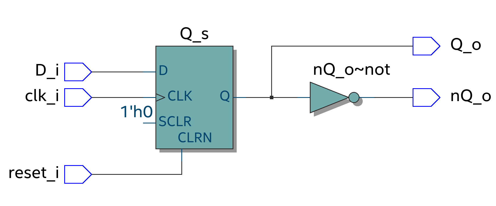
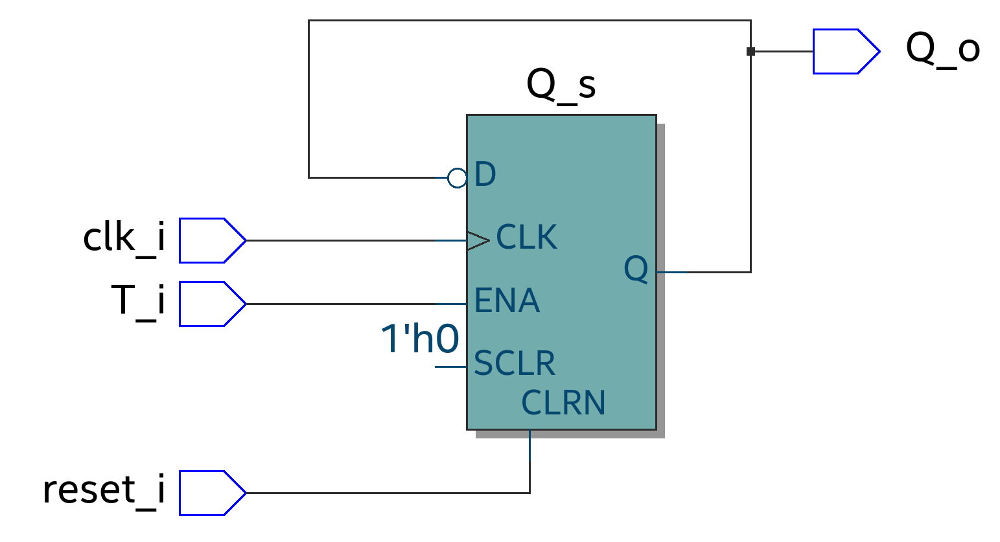
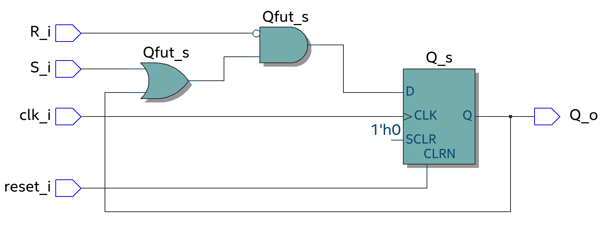
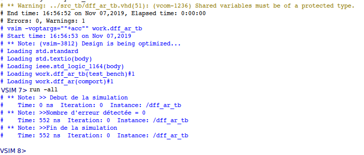
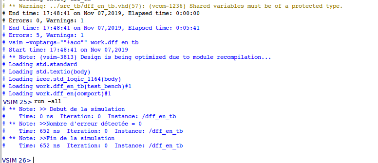
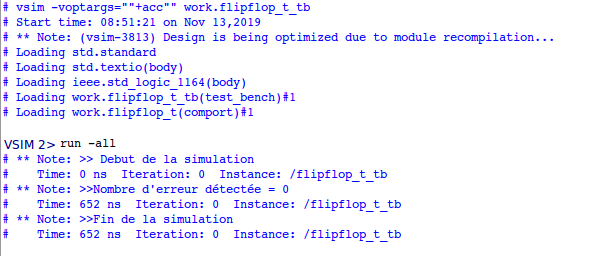

# Laboratoire 5 : Description d'éléments mémoire en VHDL
##### Autheur : Pierrick Muller
## Vues RTL
### Flip-Flop D avec not D

On peut voir que l'image ci-dessus correspond à la description VHDL que j'ai fournie. On voit bien le flip flop D avec le not en sortie permettant d'obtenir la sortie not D.

### Flip-flop D avec Enable

La vue RTL correspond à un flip flop D avec un enable.

### Flip-flop T

On peut voir que le système ci-dessus correspond à un Flip-flop T car l'entrée T est linkée sur le enable et que la sortie Q est linkée sur l'entrée D avec un not. Cela nous assure que Q+ est égal à Q si T = 0 et Q+ est égal à not Q si T = 1, comme dit dans la table de vérité.

### Flip-flop RS

Cette vue RTL correspond au schéma que j'avais établi après l'analyse de la table de vérité.

## Résultats Simulations et Compilations
### Flip-Flop D avec not D

Compilation et simulation effectuée avec succès.

### Flip-flop D avec Enable

Compilation et simulation effectuée avec succès.

### Flip-flop T

Compilation et simulation effectuée avec succès.

*Date : 13.11.2019*